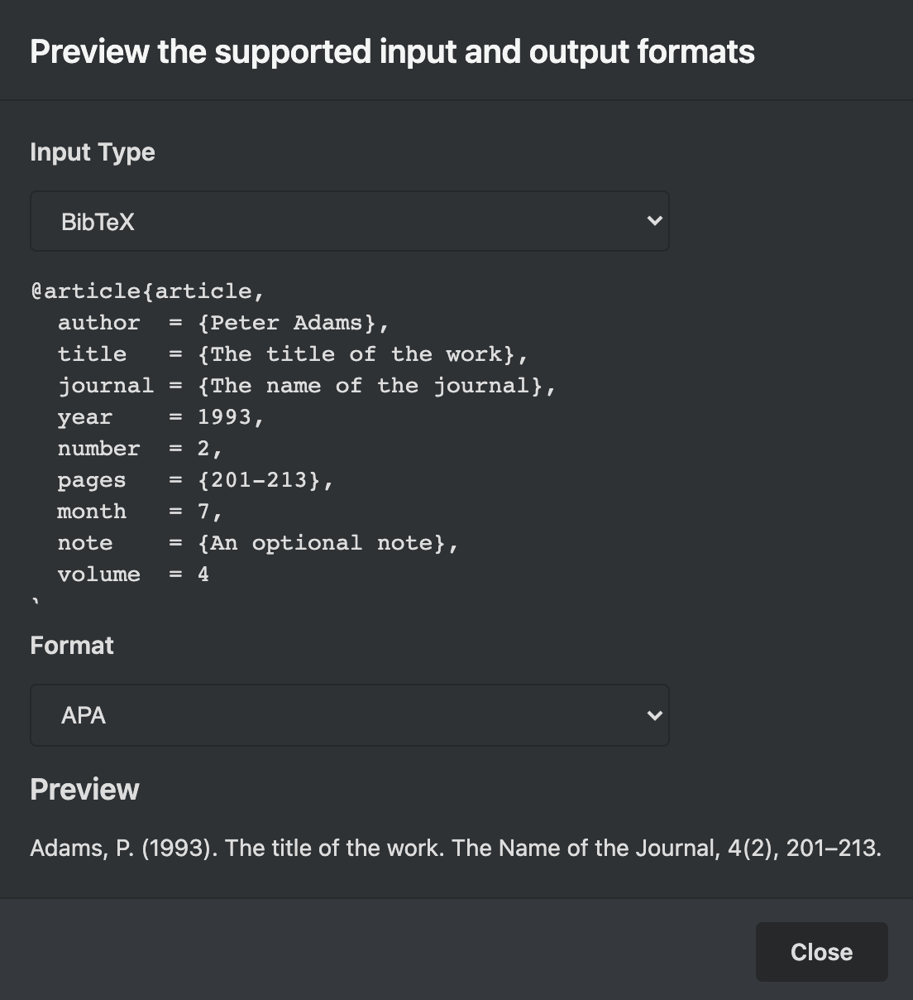
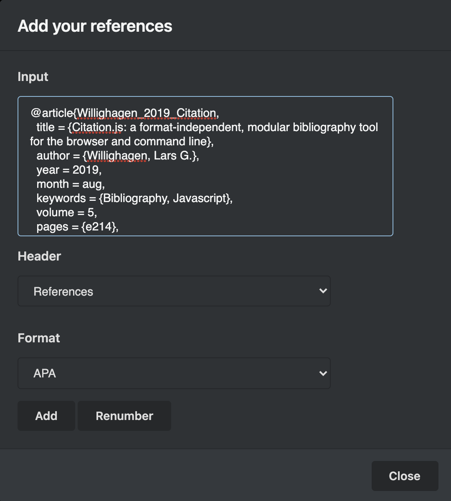
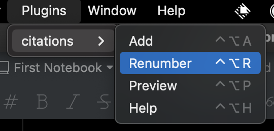

# citations

This plugin allows to easily manage your references in the Markdown files.

## Features

- Paste any citation database and automatically append it in the Markdown file.
- Supports multiple database formats, e.g., BibTeX, BibJSON, CSL-JSON, RIS.
- Preview multiple citation formats, e.g., APA, Vancouver, Harvard.
- Renumbers references if cites are out of order or missing a number.

## Install

```shell
ipm install citations
```

## Usage

There are only so many commands to use this plugin.

1. You can preview the supported input and output formats.

    

1. It is possible to append references by pasting the bibliography database content into the textbox,
choosing the header text and the output format.

    

1. Last and not least, you have the possibiity to renumber references.

    

### Keyboard Shortcuts

- `Ctrl+Alt A` or `⌃⌥A`: Append references.
- `Ctrl+Alt R` or `⌃⌥A`: Renumber references.
- `Ctrl+Alt P` or `⌃⌥P`: Preview formats.
- `Ctrl+Alt H` or `⌃⌥H`: Help dialog.

## Tips & Tricks

- Avoid modifiying the reference format and syntax as it may interfere with the plugin's commands.
- Avoid modifying the title of the reference header as it may interfere with the plugin's commands.

## Roadmap

1. Ability to delete a specific or multiple cites by its number.
2. Ability to load a cite database from the disk.

## Authors
